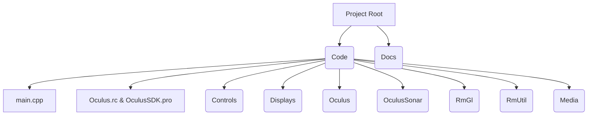

# Oculus Sonar SDK README-RC

## Introduction
This is a C++ SDK for handling sonar data from the Blueprint Subsea Oculus m3000d multi-beam sonar. The SDK provides capabilities for processing, visualization, and interaction with sonar data.

## Project Structure
The project is organized into two main directories:
- **Code/**: Contains all the core C++ source code and resources. Key components include:
  - `main.cpp`: The main entry point of the application.
  - `Oculus.rc` and `OculusSDK.pro`: Resource and project configuration files.
  - **Subdirectories within Code/**:
    - **Displays/**: Contains display components, such as `SonarSurface.h` and `SonarSurface.cpp`, which are used for graphical representation of sonar data.
    - **Controls/**: Contains UI elements like the `RangeSlider` controls.
    - **Oculus/**: Implements core sensor interfacing and data handling, including files like `Oculus.h`, `OsClientCtrl.cpp`, etc.
    - **OculusSonar/**: Contains UI components and dialogs related to sonar visualization, including several `.cpp`, `.h`, and `.ui` files.
    - **RmGl/**: Contains OpenGL-based graphics rendering components and shader files (found in `RmGl/Shaders`).
    - **RmUtil/**: Provides utility routines used throughout the SDK.
    - **Media/**: Holds images, icons, CSS files and other user interface resources.
- **Docs/**: Contains the Oculus Data Structure Definitions, providing detailed specifications for sonar data structures.

Below is a visual representation of the project structure:

## Usage Instructions
To compile the SDK, use the provided project file `OculusSDK.pro` with your preferred IDE or build system (such as Qt Creator). Include the necessary headers from the **Code/** directory in your application to integrate the SDK. Key steps include:
- Initializing the SDK components found in the `Oculus` folder.
- Setting up display modules from the `Displays` directory to visualize sonar data.
- Utilizing the controls available in the `Controls` directory for custom UI interactions.

## Data Structure Definitions
Detailed data structure definitions for managing sonar data are provided in the **Docs/** directory. Refer to these definitions to understand the format and parameters of the sonar data received from the Blueprint Subsea Oculus m3000d sonar.

## Additional Information
- **Extending the SDK**: The SDK is designed to be extensible. Developers can add new UI components or processing modules as required.
- **Licensing and Support**: Licensing information and support contacts are provided within the project documentation.
- **Version Information**: This document and SDK are part of the RC (Release Candidate) version. Future updates will include further refinements and additional features.